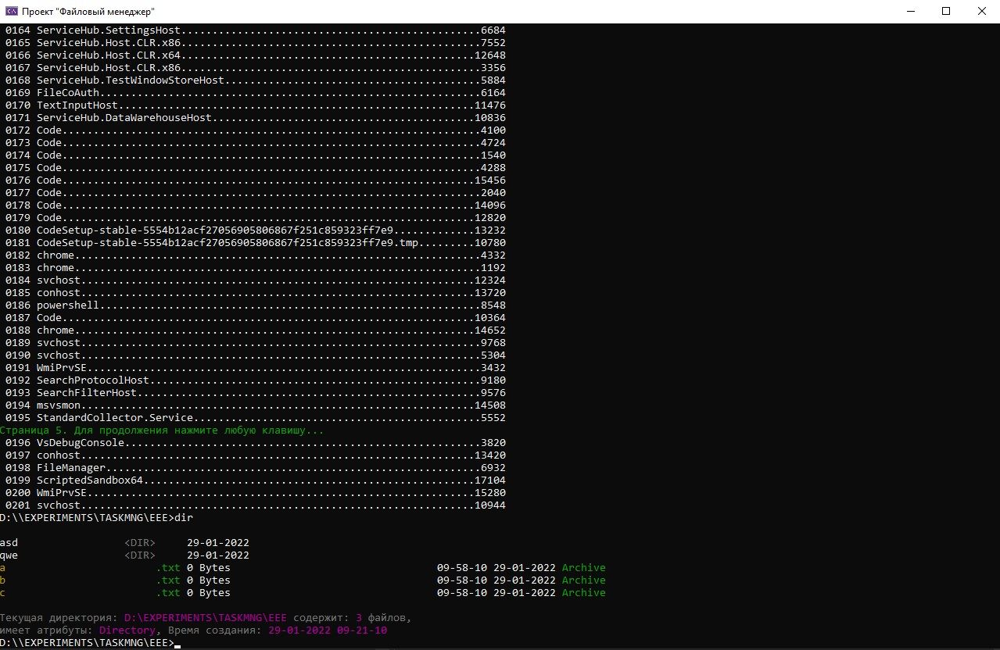
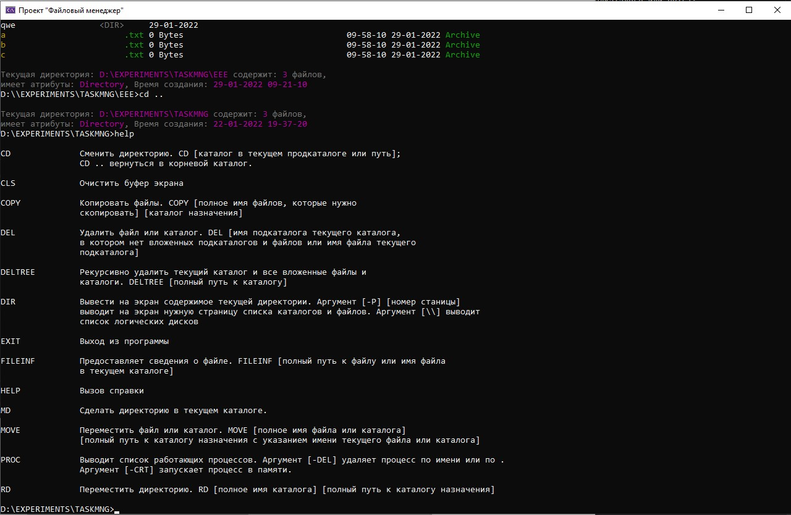
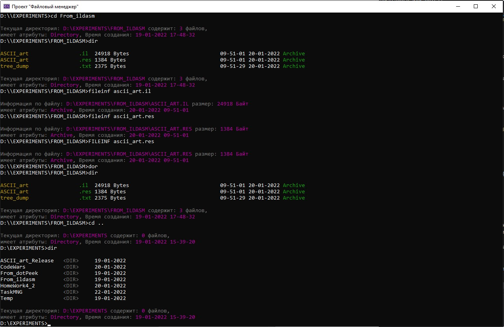

# Консольный файловый менеджер

 Файловый менеджер позволяет комфортно работать в условиях, когда нет возможности работать в другой установленной операционной системе или операционная система отсутствует. 

 

# Краткий обзор: 

Консольный файловый менеджер представляет собой консольное приложение, которое работает с каталогами, файлами и процессами системы.

# Файловый менеджер имеет функционал, схожий с функционалом операционной системы MS-DOS:

- просмотр логических дисков,
- просмотр каталогов и файлов системы,
- создание каталогов,
- удаление каталогов и файлов,
- перемещение каталогов и файлов,
- просмотр процессов в памяти,
- запуск процессов,
- удаление процессов,
- предусмотрена возможность вызова справки.


## C# Пример кода: 

<details> 
<summary> Нажмите, чтобы развернуть</summary>


```
 
  public static void ShowAllSubdirectoriesAndFilesLogic(DrivesDirectoriesFilesArray dirFiles, int userPage)
        {
            FileInfo[] files = dirFiles.Files;

            DirectoryInfo[] subdirectories = dirFiles.Directories;

            int dirStart = 0;

            int dirStop = 0;

            int fileStart = 0;

            int fileStop = 0;

            int allLinesDir = subdirectories.Length;

            int allLinesFile = files.Length;

            int allLines = allLinesDir + allLinesFile;

            if (userPage == -1)
            {
                dirStart = 0;

                dirStop = allLinesDir;

                fileStart = 0;

                fileStop = allLinesFile;
            }
            else
            {
                int pageDir = 1 + allLinesDir / PseudoConsoleUI.PAGE_LINES;

                int restDirLines = allLinesDir % PseudoConsoleUI.PAGE_LINES;

                int linesOfFileAfterDir = PseudoConsoleUI.PAGE_LINES - restDirLines;

                int filesdir = (allLinesFile - linesOfFileAfterDir) / PseudoConsoleUI.PAGE_LINES + 1;

                if (userPage < pageDir)
                {
                    dirStart = (userPage - 1) * PseudoConsoleUI.PAGE_LINES;

                    dirStop = userPage * PseudoConsoleUI.PAGE_LINES;
                }
                if (userPage == pageDir)
                {
                    if ((restDirLines + allLinesFile) / PseudoConsoleUI.PAGE_LINES == 0)
                    {
                        dirStart = (userPage - 1) * PseudoConsoleUI.PAGE_LINES;

                        dirStop = allLinesDir;

                        fileStop = allLinesFile;
                    }
                    if ((restDirLines + allLinesFile) / PseudoConsoleUI.PAGE_LINES > 0)
                    {
                        dirStart = (userPage - 1) * PseudoConsoleUI.PAGE_LINES;

                        dirStop = allLinesDir;

                        fileStop = linesOfFileAfterDir;
                    }
                }
                if (userPage > pageDir)
                {
                    if (userPage < (pageDir + filesdir))
                    {
                        fileStart = linesOfFileAfterDir + (userPage - pageDir - 1) * PseudoConsoleUI.PAGE_LINES;

                        fileStop = linesOfFileAfterDir + (userPage - pageDir) * PseudoConsoleUI.PAGE_LINES;
                    }
                    if (userPage >= (pageDir + filesdir))
                    {
                        fileStart = linesOfFileAfterDir + (userPage - pageDir - 1) * PseudoConsoleUI.PAGE_LINES;

                        fileStop = allLinesFile;
                    }
                }
            }
            PseudoConsoleUI.PrintAllSubdirectoriesAndFilesByPages(dirFiles, dirStart, dirStop, fileStart, fileStop);

            PseudoConsoleUI.PrintPageNumber(allLines, userPage);
        }

``` 

</details> 


## Скриншоты

<details> 
<summary> Нажмите, чтобы развернуть</summary>

- Список процессов



- Помощь



- Список подкаталогов текущего каталога



</details> 